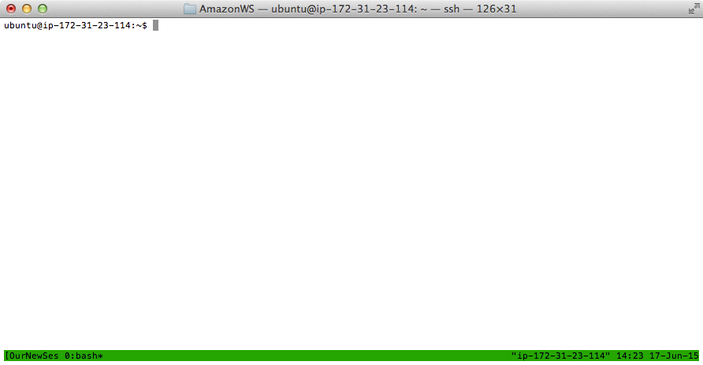

# Tmux for remote sessions
Authored by Jackson Sorensen for EDMAME2015     
[EDAMAME-2015 wiki](https://github.com/edamame-course/2015-tutorials/wiki)

***
EDAMAME tutorials have a CC-BY [license](https://github.com/edamame-course/2015-tutorials/blob/master/LICENSE.md). _Share, adapt, and attribute please!_
***

## Overarching Goal
* This tutorial will contribute towards developing **computing literacy**.

## Learning Objectives
* Determine in what situations a remote session is useful
* Start, detach, and attach to a tmux session

***

# First thing let's download and uncompress some data you'll need later
```
wget https://s3.amazonaws.com/edamame/infant_gut.sub.tar.gz
tar xvfz infant_gut.sub.tar.gz
```

# Using tmux

Whenever you are connected to an Amazon EC2 you are at the mercy of your internet connection. Let's say you are running a really long process like OTU picking or metagenome assembly. If your internet connection cuts out during this process, the program won't finish and you won't be able to start back up where it stopped. In order to get around this we can use a program called tmux. tmux allows you to keep running programs even if your internet connection cuts out during the process. It does this by making a virtual session inside of your remote instance. While in theory this sounds confusing, in practice it is not very difficult. Let's start of by making a new virtual session using tmux. 

```
tmux new -s OurNewSession
```

Once you type in the above command your terminal will look something like this.

 

The green line on the bottom indicates that you are in a virtual session using tmux. Now for the sake of demonstration on the benefits of tmux we are going to open up one of our fastq files using `less`.

```
less SRR492065_1.sub.fastq.gz
```

This should open up the file `RR492065_1.sub.fastq.gz` and allow us to scroll through the sequences using the arrow keys. Normally, if we wanted to quit `less` we would just hit the `q` key and it will stop the program. For the purposes of this tutorial though let's say we want to keep `less` open and running, like we will want to do for OTU picking or metagenome assembly. We are going to "detach" from our running virtual session of tmux while still having `less` running. We do this with the follow command. 

```
ctrl+b d
```

Hold control while hitting b then release and hit d. This will detach you from your tmux session. Go ahead and navigate around your instance for a bit. Change to another directory, `head` a file you are interested in, or try creating a new file with `nano`. You could decide to logout of your instance using `exit` and then log back in with `ssh`. After you've spent some time doing other things, reattach to your virtual session of tmux using the following command. 

```
tmux attach -t OurNewSession
```

You should see the green bar at the bottom and that `less` still has `SRR492065_1.sub.fastq.gz` open to the place where you left it. The utility of tmux will be very useful later in this course during some of our longer steps. I recommend running anything that will take longer than five minutes in a virtual session of tmux. 

When you are completely finished and want to kill your tmux session, run the following command:

```
ctrl+d
```

Tmux has several other capabilities that I do not go into here. You can make several sessions, windows inside of a session, etc. If you are interested in learning more about some of these other features of tmux there is a nice cheat sheet of commands [here](https://gist.github.com/MohamedAlaa/2961058) 

***
## Help and other resources
* [GitHub](http://tmux.github.io/)
* [Tmux user manual](http://www.openbsd.org/cgi-bin/man.cgi/OpenBSD-current/man1/tmux.1?query=tmux&sec=1)
* [Another cheat sheet](http://www.dayid.org/os/notes/tm.html)
* An alternative to tmux:  [screen](http://aperiodic.net/screen/quick_reference)

       
