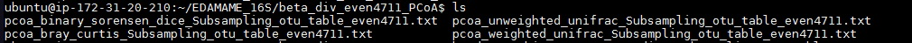
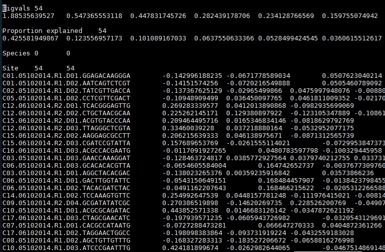
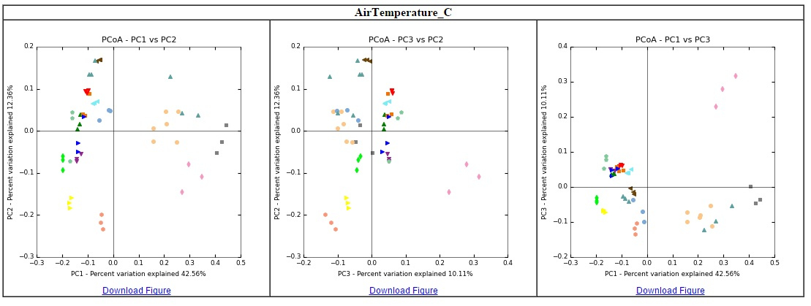
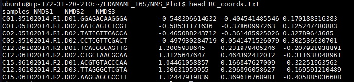
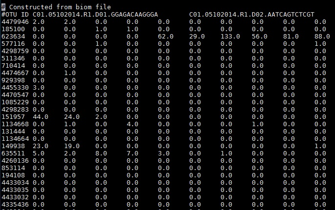

#QIIME Tutorial 3:  Comparative diversity
***

Authored by Ashley Shade, with modifications by Sang-Hoon Lee and Siobhan Cusack  
[EDAMAME-2015 wiki](https://github.com/edamame-course/2015-tutorials/wiki)

***
EDAMAME tutorials have a CC-BY [license](https://github.com/edamame-course/2015-tutorials/blob/master/LICENSE.md). _Share, adapt, and attribute please!_
***

##Overarching Goal  
* This tutorial will contribute towards an understanding of **microbial amplicon analysis**

##Learning Objectives
* Calculate resemblance matrices from an OTU table
* Visualize comparative diversity across a priori categorical groups
* Convert .biom formatted OTU tables to text files for use outside of QIIME

***

## 3.1 Make resemblance matrices to analyze comparative (beta) diversity
Make sure that you are in the EDAMAME_16S/usearch61_openref/ directory.  

If you need the Subsampling_otu_table_even4711.biom file from Parts 1 and 2 of the tutorial you can use curl to grab it from GitHub:
```
curl -O https://raw.githubusercontent.com/edamame-course/2015-tutorials/master/QIIME_files/otu_table_mc2_w_tax_even4711.biom
```
 
We will make four kinds of resemblance matrices (sample by sample comparisons) for assessing comparative diversity.

Use the `-s` option to see all of the different options for calculating comparative (beta) diversity in QIIME.

```
beta_diversity.py -s
```
What are all these indices, mathematically?  Where do they all come from?  All that info is in the guts of the [script](https://github.com/pycogent/pycogent/blob/master/cogent/maths/distance_transform.py), which is really hard to work through, but it is there.

To compare weighted/uweighted and phylogenetic/taxonomic metrics, we will ask QIIME to create four resemblance matrices of all of these different flavors.  Navigate into the usearch61_openref/ directory.

```
beta_diversity.py -i otu_table_mc2_w_tax_even4711.biom -m unweighted_unifrac,weighted_unifrac,binary_sorensen_dice,bray_curtis -o compar_div_even4711/ -t rep_set.tre
```
Due to a bug in this version of QIIME (v 1.9.1), this may return a warning that says "VisibleDeprecationWarning". Do not be alarmed. The script has still worked as it was supposed to. Navigate to the new directory called "compar_div_even4711". 

There should be four new resemblance matrices in the directory.  Use nano to opem them and compare their values.  
```
nano binary_sorensen_dice_otu_table_mc2_w_tax_even4711.txt 
```

This should be a square matrix, and the upper and lower triangles should be mirror-images. 

_Pop quiz:  Why is the diagonal zero?_


We're going to get all crazy and move these outside of the terminal. Use scp to transfer them to your desktop.  We will come back to these files for the R tutorial, so remember where you stash them!  

From a terminal with your computer as the working directory, grab all files in this directory ending in .txt using the wildcard `*` (which is all of them).

```
scp -i your/key/file ubuntu@ec2-your_DNS.compute-1.amazonaws.com:EDAMAME_16S/usearch61_openref/compar_div_even4711/*.txt /home/your_username/Desktop
```


## 3.2 Using QIIME for visualization:  Ordination

QIIME scripts can easily make an ordination using principal coordinates analysis (PCoA). We'll perform PCoA on all resemblance matrices, and compare them.  Documentation is [here](http://qiime.org/scripts/principal_coordinates.html).  As always, make sure you are in the EDAMAME_16S directory to execute these analyses.


```
principal_coordinates.py -i compar_div_even4711/ -o compar_div_even4711_PCoA/
```

Notice that the `-i` command only specifies the directory, and not an individual filepath.  PCoA will be performed on all resemblances in that directory. 
This will likely give a runtime warning: "The result contains negative eigenvalues." As the warning explains, this can usually be safely ignored if the magnitude of the negative value is smaller than the magnitude of the largest eigenvalues. In our case, the negative value is several orders of magnitude smaller than the largest eigenvalue, so we can ignore this warning. However, this is something to keep in mind when performing your own analyses. 

If we navigate into the new directory, we see there is one results file for each input resemblence matrix.




Inspect one of these files.
```
more pcoa_bray_curtis_otu_table_mc2_w_tax_even4711.txt
```



The first column has SampleIDs, and column names are PCoA axis scores for every dimension.  In PCoA, there are as many dimensions (axes) as there are samples. Remember that, typically, each axis explains less variability in the dataset than the previous axis.

These PCoA results files can be imported as text files into other software for making ordinations outside of QIIME.

Navigate back into the usearch61_openref/ directory.

We can make 2d plots of the output of `principal_coordinates.py`, and map the colors to the categories in the mapping file.

```
make_2d_plots.py -i compar_div_even4711_PCoA/pcoa_weighted_unifrac_otu_table_mc2_w_tax_even4711.txt -m ../MappingFiles/Centralia_Full_Map.txt -o PCoA_2D_plot/
```
(This will also give a runtime warning: "More than 20 figures have been opened. Figures created through the pyplot interface (`matplotlib.pyplot.figure`) are retained until explicitly closed and may consume too much memory." However, the script will execute as intended.) 

Open a new (non- EC2) terminal. Use scp from the new terminal to transfer the new html file and its companion files to your desktop (using `-r` to take the whole directory), then open the html file.
```
scp -r -i **your key** ubuntu@e**your DNS**:EDAMAME_16S/usearch61_openref/PCoA_2D_plot/pcoa_weighted_unifrac_otu_table_mc2_w_tax_even4711_2D_PCoA_plots.html ~/Desktop 
```



This is where  a comprehensive mapping file is priceless because any values or categories reported in the mapping file will be automatically color-coded by QIIME for data exploration.  It is like MAGIC!


Take some time to explore these plots: toggle samples, note color categories, hover over points to examine sample IDs.   
_What hypotheses can be generated based on exploring these ordinations?  What  environmental measurements or categories seem to have the most explanatory value in distinguishing communities?_

*Exercise*
Make 2D plots for each PCoA analysis from each of the four difference resemblance results and compare them.  How are the results different, if at all?  Would you reach difference conclusions?


### 3.3  Other visualizations in QIIME
We can make a non-metric multidimensional scaling (NMDS) plot.
Navigate back to usearch61_openref/ directory.

```
mkdir NMDS_Plot
nmds.py -i compar_div_even4711/bray_curtis_otu_table_mc2_w_tax_even4711.txt -o NMDS_Plot/mc2_even4711_braycurtis_NMDS_coords.txt
cd NMDS_Plot
head mc2_even4711_braycurtis_NMDS_coords.txt
```


We can also make a quick heatmap in QIIME, which shows the number of sequences per sample relative to one another.  For our sanity (do you really want to look at ~20K OTUs at once?), let's make this heatmap at the phylum level.  To do this, we will go find our phylum-level OTU table in the WS_Diversity/ directory

```
make_otu_heatmap.py -i WS_Diversity_even4711/taxa_summary4711/otu_table_mc2_w_tax_even4711_L2.biom -o heatmap_L2_even4711.pdf
```

Move it to your desktop and open.
```
 scp -r -i **yourkey** ubuntu@**yourDNS**:EDAMAME_16S/usearch61_openref/heatmap_L2_even4711.pdf  ~/Desktop 
```

Explore this visualization.  You can filter the minimum number of OTUs, filter by sample ID, or by OTU ID.  Heatmap documentation is [here](http://qiime.org/scripts/make_otu_heatmap.html).


### 3.4  "Collapse" the biom table across DNA extraction replicates 
  
We have 3 replicate DNA extractions from one soil core that were separately amplified and sequenced. After inspecting the PCoA plots coded by "Sample", we can be assured that the replicate samples are quite similar to each other. The DNA extraction replicates are technical replicates:  they are not part of the sampling design.  Rather, they are an internal experimental "sanity check."  We should not include them as replicates in downstream analysis because it would artificially inflate our sample size. Therefore, we want to generate a dataset where the replicates are averaged into a single observation for each core.   
_Experimental Design Question: Why should we average the replicates?  Are there any alternative to averaging that would also be appropriate?_   

Documentation for collapse_samples.py is [here](http://qiime.org/scripts/collapse_samples.html).  This is a really useful command - you can also easily normalize the data (make a relativized dataset).
```
collapse_samples.py -b otu_table_mc2_w_tax_even4711.biom -m ../MappingFiles/Centralia_Full_Map.txt --collapse_fields Sample --collapse_mode mean -o otu_table_mc2_w_tax_even4711_CollapseReps.biom

###3.5 Exporting the QIIME-created biom table for use in other software (R, Primer, Phinch, etc)
This command changes frequently, as the biom format is a work in progress.  Use `biom convert -h` to find the most up-to-date arguments and options.

In the example below, we are making a tab-delimited text file (designated by the `--to-tsv` option) and including a final column for taxonomic assignment called "Consensus lineage".

```
mkdir biom_converted_mc2_tax_even4711_CollapseReps

biom convert -i otu_table_mc2_w_tax_even4711_CollapseReps.biom -o biom_converted_mc2_tax_even4711/otu_table_mc2_w_tax_even4711_CollapseReps.txt --table-type "OTU table" --to-tsv --header-key taxonomy --output-metadata-id "ConsensusLineage"

```


What are we going to do with this file?  Move it to our desktop for our future R analysis, of course!  Switch to your computer's terminal (not the EC2) to transfer the file using `scp`. 

```
scp -i **yourkey** ubuntu@**yourDNS**:EDAMAME_16S/usearch61_openref/biom_converted_mc2_tax_even4711/otu_table_mc2_w_tax_even4711_CollapseReps.txt ~/Desktop
```

Now, open it and make sure it is as you expect.  It should be a classic Species X Sample OTU table.

***
# YOU DID IT!   HOLIDAY!   CELEBRATE!
***


## Help and other Resources
###Ordinations and resemblance
* [The Ordination Web Page - great resource](http://ordination.okstate.edu/)
* Legendre & Legendre's book [Numerical Ecology](http://www.amazon.com/Numerical-Ecology-Developments-Environmental-Modelling/dp/0444538682/ref=sr_1_1?ie=UTF8&qid=1434659276&sr=8-1&keywords=numerical+ecology) has All The Resemblance Metrics.

###Biom table conversion
* [Documentation](http://biom-format.org/documentation/biom_conversion.html)

### QIIME help
*  [QIIME](qiime.org) offers a suite of developer-designed [tutorials](http://www.qiime.org/tutorials/tutorial.html).
*  [Documentation](http://www.qiime.org/scripts/index.html) for all QIIME scripts.
*  There is a very active [QIIME Forum](https://groups.google.com/forum/#!forum/qiime-forum) on Google Groups.  This is a great place to troubleshoot problems, responses often are returned in a few hours!
*  The [QIIME Blog](http://qiime.wordpress.com/) provides updates like bug fixes, new features, and new releases.
*  QIIME development is on [GitHub](https://github.com/biocore/qiime).

-----------------------------------------------
-----------------------------------------------

