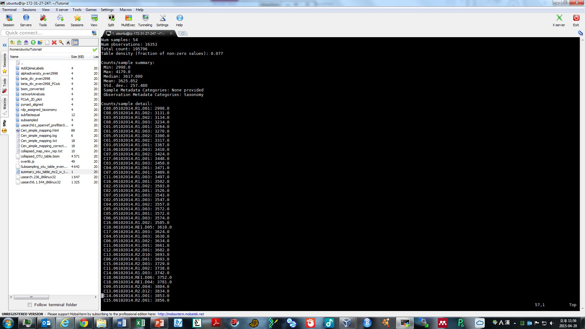
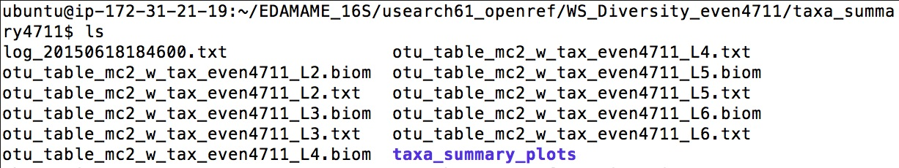
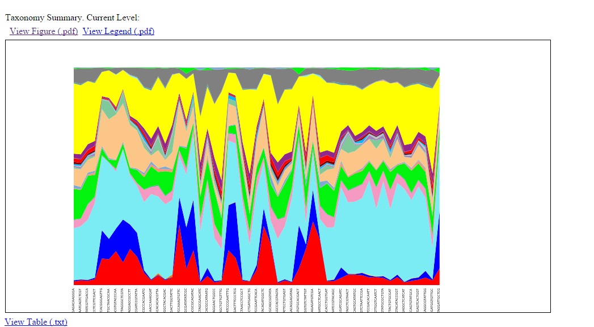
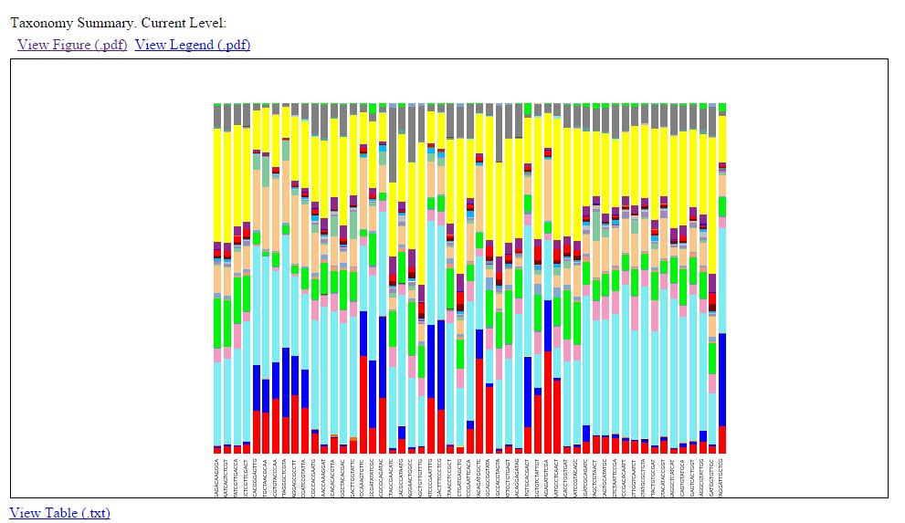

#QIIME Tutorial 2
Authored by Ashley Shade, with contributions by Sang-Hoon Lee and Siobhan Cusack  
[EDAMAME-2015 wiki](https://github.com/edamame-course/2015-tutorials/wiki)

***
EDAMAME tutorials have a CC-BY [license](https://github.com/edamame-course/2015-tutorials/blob/master/LICENSE.md). _Share, adapt, and attribute please!_
***

##Overarching Goal  
* This tutorial will contribute towards an understanding of **microbial amplicon analysis**

##Learning Objectives
* Extract summary information from a biom OTU table
* Subsample a dataset to an even sequencing coverage across all ccommunity observations
* Calculate and visualize within-sample (alpha) diversity

***


###Handout of workflow:
-  [Paired-End Illumina QIIME open-reference workflow](https://github.com/edamame-course/2015-tutorials/blob/master/QIIME_files/QIIME%20flow%20chart.pdf)

***

_Welcome back, Microbe Enthusiasts!_  

## Working with the OTU table in QIIME

Previously, we left off with quality-controlled merged Illumina paired-end sequences, and then used a QIIME workflow script to pick OTUs with one representative sequence from each OTU, align the representative sequences, build a tree build the alignment, and assign taxonomy to the OTU based on the representative sequence.  Wow.  That is a LOT.  Take a moment to relish in your own computational prowess.


### 2.1  Summarize an OTU table

Navigate to the usearch61_openref/ directory. The OTU table is the table on which all ecological analyses (e.g. diversity, patterns, etc) are performed.  Let's use biom commands to summarize the table.  Let's proceed with the table that has singletons removed and taxonomy assigned ("mc2_w_tax.biom").

```
biom summarize_table -i otu_table_mc2_w_tax.biom -o summary_otu_table_mc2_w_tax.txt

more summary_otu_table_mc2_w_tax.txt 
```

The summary file contains information about the number of sequences per sample, which will help us to make decisions about rarefaction (subsampling).  When we inspect the file, we see that sample C03.05102014.R1.D02.CTAACCTCCGCT has the minimum number of reads observed.  This is what we will use as a subsampling depth.  Also, a lot of the info in this file is typically reported in methods sections of manuscripts.




### 2.2 Rarefaction (subsampling)

***
*BREAK* Subsampling Learning Activity!
***


Before we start any ecological analyses, we want to evenly subsample ("rarefy", but see this [discussion](http://www.ploscompbiol.org/article/info%3Adoi%2F10.1371%2Fjournal.pcbi.1003531)) all the samples to an equal ("even") number of sequences so that they can be directly compared to one another. Many heartily agree (as exampled by [Gihring et al. 2011](http://onlinelibrary.wiley.com/doi/10.1111/j.1462-2920.2011.02550.x/full)) that sample-to-sample comparisons cannot be made unless subsampling to an equal sequencing depth is performed. 

To subsample the OTU table, we need to decide the appropriate subsampling depth. What is the best number of sequences?  As a rule, we must subsample to the minimum number of sequences per sample for all samples *included* in analyses.  Sometimes this is not straightforward, but here are some things to consider:

*  Are there low-sequence samples that have very few reads because there was a technological error (a bubble, poor DNA extraction, poor amplification, etc)?  These samples should be removed (and hopefully re-sequenced), especially if there is no biological explanation for the low number of reads.
*  How complex is the community?  An acid-mine drainage community is less rich than a soil, and so fewer sequences per sample are needed to evaluate diversity.
*  How exhaustive is the sequencing?  If this is unknown, an exploratory rarefaction analysis could be done to estimate.
*  How important is it to keep all samples in the analysis?  Consider the costs and benefits of, for example, dropping one not-very-well-sequenced replicate in favor of increasing overall sequence information.  Will it destroy your experimental design if you remove a few samples? If you've got $$ to spare, built-in sequencing redundancy/replication is helpful for this.
*  Don't fret!  Soon sequencing will be so inexpensive that we will be sequencing every community exhaustively and not have to worry about it anymore.

In this example dataset, we want to keep all of our samples, so we will subsample to 4711, which is the minimum number of sequences in any sample.  Documentation is [here](http://qiime.org/scripts/single_rarefaction.html?highlight=rarefaction).

```
single_rarefaction.py -i otu_table_mc2_w_tax.biom -o otu_table_mc2_w_tax_even4711.biom -d 4711
```

We append _even4711 to the end of the table to distinguish the subsampled table from the full table.  This is even4711 table is the final biom table on which to perform ecological analyses.  If we run the [biom summary](http://biom-format.org/documentation/summarizing_biom_tables.html) command, we will now see that every sample in the new table has exactly the same number of sequences:

```
biom summarize_table -i otu_table_mc2_w_tax_even4711.biom -o summary_otu_table_mc2_w_tax_even4711.txt

head summary_otu_table_mc2_w_tax_even4711.txt
```


Our "clean" dataset has 54 samples and 24,263 OTUs defined at 97% sequence identity.

There is a [paper](http://www.ploscompbiol.org/article/info%3Adoi%2F10.1371%2Fjournal.pcbi.1003531) that suggests that even subsampling is not necessary, but this is very actively debated.

### 2.3 Calculating within-sample (alpha) diversity

Navigate back into the usearch61_openref/ directory, and make a new directory for alpha diversity results.

```
mkdir WS_Diversity_even4711/

```

We will calculate richness (observed # taxa) and phylogenetic diversity (PD) for each sample.  Documentation is [here](http://qiime.org/scripts/alpha_diversity.html).

```
alpha_diversity.py -i otu_table_mc2_w_tax_even4711.biom -m observed_species,PD_whole_tree -o WS_Diversity_even4711/WS_Diversity_even4711.txt -t rep_set.tre
```

The `-t` flag designates the tree file for calculating phylogenetic diversity. As always, inspect the results file.  What are the ranges that were observed in richness and PD?

```
head WS_Diversity_even4711/WS_Diversity_even4711.txt
```

QIIME offers a variety of additional options for calculating diversity, and the -s option prints them all!

```
alpha_diversity.py -s
```

There is workflow script, [alpha_rarefaction.py](http://qiime.org/scripts/alpha_rarefaction.html), which is useful if you want to understand how measures of alpha diversity change with sequencing effort.  The script calculates alpha diversity on iterations of a subsampled OTU table.

### 2.4 Visualizing within-sample diversity

`summarize_taxa_through_plots.py` is a QIIME workflow script that calculates summaries of OTUs at different taxonomic levels. Documentation is [here](http://qiime.org/scripts/summarize_taxa_through_plots.html). This will take about 10 minutes; if you want to be safe, you can [tmux](https://github.com/edamame-course/2015-tutorials/blob/master/final/2015-06-22_tmux.md).

```
summarize_taxa_through_plots.py -o WS_Diversity_even4711/taxa_summary4711/ -i otu_table_mc2_w_tax_even4711.biom 
```

When the script is finished, navigate into the results file, and into the "taxa_summary_plots" and find the html area and bar charts.
As you are navigating to these html files, notice that the script has produced an OTU/biom table for every taxonomic level (designated by the "L"):



The "L" stands for "lineage", and each "level" is designated by a number.  L1 is Domain, L2 is Phylum, L3 is Class, etc.  The more resolved the lineage (higher number), the less accurate the definition (e.g., L6 is not entirely and consistently the same as  "genus").

To view the HTML files, you will need to transfer the HTML files themselves and their companion files in the ```charts``` directory to your desktop using scp. Open a terminal with the working directory on your computer, not the EC2.

```
scp -i **your/key/file** ubuntu@**your_DNS**:EDAMAME_16S/usearch61_openref/WS_Diversity_even4711/taxa_summary4711/taxa_summary_plots/bar_charts.html ~/Desktop

scp -i **your/key/file** ubuntu@**your_DNS**:EDAMAME_16S/WS_Diversity_even4711/taxa_summary4711/taxa_summary_plots/area_charts.html ~/Desktop

scp -r -i **your/key/file** ubuntu@**your_DNS**:EDAMAME_16S/WS_Diversity/taxa_summary4711/taxa_summary_plots/charts /home/your_username/Desktop

```
The last command above contains the ```-r``` flag after ```scp```. The r means "recursive", and specifies that because we have a whole directory full of files, we want scp to go back and grab all of the files there, not just one. You will get an error if you try to scp a directory without the -r flag.  

Now go to the desktop and double-click on area_charts.html:


 and bar_charts.html:



The links above and below the charts point to the raw data or other summaries.  Spend some time exploring all of the different links.

In your browser, carefully inspect and interact with these quick charts.  Though these are not publication-ready, they are a great first exploration of the taxa in the dataset.


***

## Where to find QIIME resources and help
*  [QIIME](qiime.org) offers a suite of developer-designed [tutorials](http://www.qiime.org/tutorials/tutorial.html).
*  [Documentation](http://www.qiime.org/scripts/index.html) for all QIIME scripts.
*  There is a very active [QIIME Forum](https://groups.google.com/forum/#!forum/qiime-forum) on Google Groups.  This is a great place to troubleshoot problems, responses often are returned in a few hours!
*  The [QIIME Blog](http://qiime.wordpress.com/) provides updates like bug fixes, new features, and new releases.
*  QIIME development is on [GitHub](https://github.com/biocore/qiime).


-----------------------------------------------
-----------------------------------------------
