#Data quality checking with FastQC

Authored by Siobhan Cusack

####Information in this tutorial is based on the FastQC manual which can be accessed [here](http://www.bioinformatics.babraham.ac.uk/projects/fastqc/Help/3%20Analysis%20Modules/).

FastQC is a relatively quick and non labor-intesive way to check the quality of your NGS data.

After connecting to the QIIME AMI and downloading the data from the cloud, navigate to the 16S directory.
```
cd EDAMAME_Datasets/16S
```

Before starting, we need to make sure we have sequencing files that end in .fastq
=======
Before starting, we need to install FastQC on our AMI. From the home directory:
>>>>>>> 3a536aeb4bce3d4b992a960c8a79a6a8f6bf6703

```
wget http://www.bioinformatics.babraham.ac.uk/projects/fastqc/fastqc_v0.11.3.zip
```
This will download a .zip file into the home directory. Let's unzip it.

```
unzip fastqc_v0.11.3.zip
```
This will create a new directory called FastQC with all of the program files in it. We need to change the permissions on the executable file in order to run the program.

```
cd FastQC
```
You should now see a lot of files and new directories. "fastqc" will be in white, meaning we cannot execute the file.
```
chmod 755 fastqc
ls
```
"fastqc" should now be in green. Now we can execute it! We need to copy a .fastq file into this folder in order to run the program. We'll use forward.fastq, which is a file containing all forward reads from our 16S tag sequencing. Once we have copied it into the FastQC folder, we will run the program.

```
./fastqc forward.fastq

```
This will create two new files with the same name and the extensions `.fastqc.zip` and `fastqc.html`. As you may be able to guess, these are processed files in zip and html format.

Using scp, transfer the html file to your desktop. Now double-click on the file and it should open in your browser.
On the left-hand side of the screen, there will be a summary of the analyses with some combination of green checkmarks, yellow exclamation points, and red Xs, depending on whether or not the sequences pass the quality check for each module.


###1: Basic Statistics
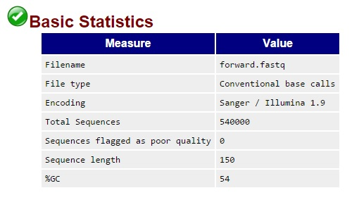

Basic statistics displays a chart containing information about your file, including the name, how many reads were analyzed, and whether or not any of the reads were flagged for poor quality. In this case, we had 540,000 sequences. None of them were flagged as poor quality. The average sequence length was 150 bases, with 54% GC content.

###2: Per base sequence quality
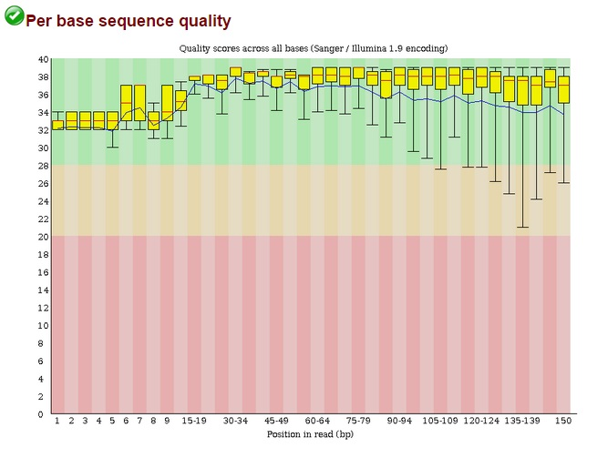

Per base sequence quality shows the quality of each sequence at every position from 1 to 150, in this case. It displays this information using box and whisker plots to give a sense of how much variation there was among the reads. Ideally we would want the entire plot to be contained within the green region; this would be considered very good quality. While having part of the plot in the orange or red regions is not preferable, sequences can still pass the quality check if this is the case, as in our example. When the lower quartile for any position is less than 10 or the median is less than 25, the module will give a warning. When the lower quartile for any position is less than 5 or the median is less than 20, the sequence will fail this quality check.

###3: Per tile sequence quality
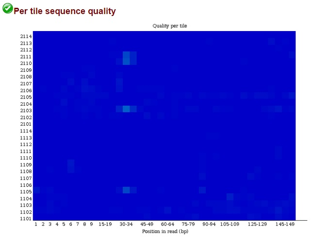

Per tile sequence quality is a heatmap display of the flow cell quality by individual tiles. If the figure is a solid bright blue, the flow cell tile quality was consistently great! If there are patches of lighter blue or any other color, there was a problem associated with one of the tiles (such as a bubble or smudge) and this may correspond with a decrease in sequence quality in those regions. Above you can see light blue patches which indicate potential problems with the sequencing lane. However, in this case it is still good enough to pass the quality check; this would be more concerning if we had orange or red tiles.

###4: Per sequence quality scores
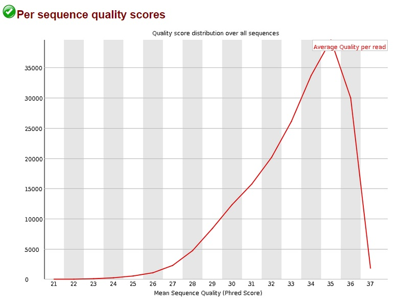

Per sequence quality scores represent the quality of each read. The y-axis is number of sequences, and the x-axis uses Phred scores, which are based on a logarithmic scale. A Phred score of 30 indicates an error rate of 1 base in 1000, or an accuracy of 99.9%, while a Phred score of 40 indicates an error rate of 1 base in 10,000, or an accuracy of 99.99%. Sequences will yield a warning for this module if there is an error rate of 0.2% or higher (Phred score below 27). Sequences will fail this quality check if they have an error rate of 1% or higher (Phred score below 20.)
In our example, the average quality per read is 37, which is very good.

###5: Per base sequence content
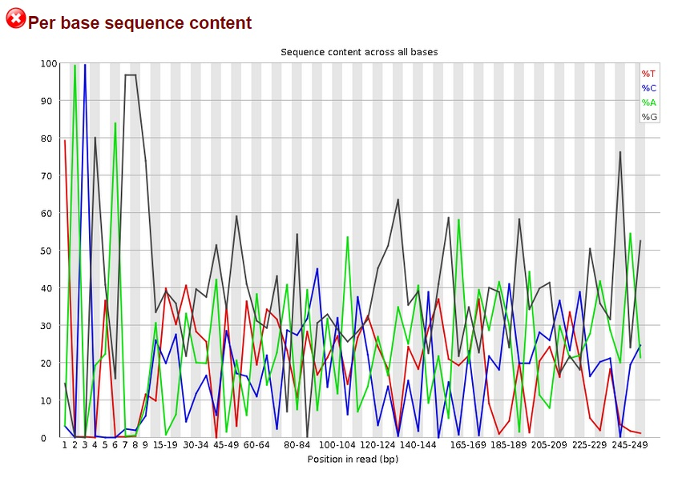

Per base sequence content shows, for each position of each sequence, the base composition as a percentage of As, Ts, Cs and Gs. This module will yield a warning if the base content varies more than 10% at any position, and a sample will fail if there is more than 20% variation at any position, as in the example above. However, FastQC is designed for checking whole genome sequencing data, but we used 16S sequences for our input files. So although we have a failure for this module, it's not because there's something wrong with our sequences. It's simply because we used sequences that are enriched for certain bases, rather than completely random sequences from a whole genome.

###6: Per sequence GC content
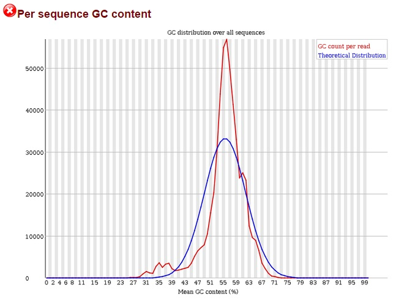

Per sequence GC content displays the GC content for all reads along with the "theoretical distribution" of GCs. The peak of the red line corresponds to the mean GC content for the sequences, while the peak of the blue line corresponds to the theoretical mean GC content. Your GC content should be normally distributed; shifts in the peak are to be expected since GC content varies between organisms, but anything other than a normal curve might be indicative of contamination. The sharp peak seen above is again due to the fact that we have enriched for a specific sequence, so we expect the majority to have about the same GC content.

A warning is raised if sequences outside of the normal distribution comprise more than 15% of the total. A sample will fail if more than 20% of sequences are outside the normal distribution. Failures are usually due to contamination, frequently by adapter sequences.

###7: Per base N content
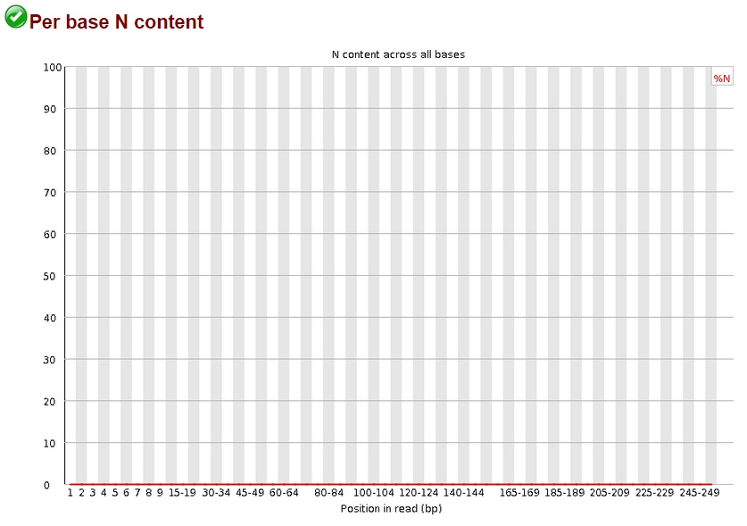

Per base N content shows any positions within the sequences which the which have not been called as A, T, C or G. Ideally the per base N content will be a completely flat line at 0% on the y-axis, indicating that all bases have been called. Samples receive a warning if the N content is 5% or greater, and will fail if N content is 20% or greater. Our example shows the ideal result for this module!

###8: Sequence length distribution
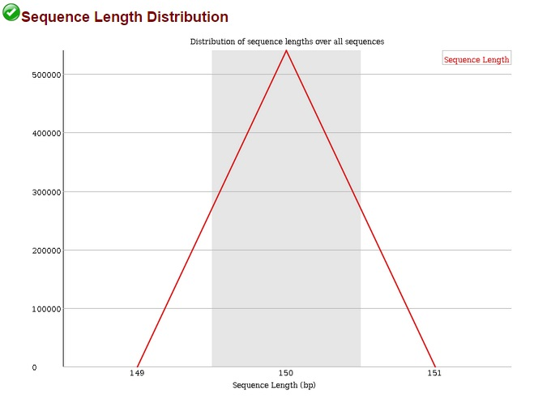

This module simply shows the length of each sequence in the sample. Depending on the sequencing platform used, this will vary. For Illumina sequencing, each read should be the same size, with variation of one or two bases being acceptable. For other platforms, a relatively large amount of variation is normal. The module will show a warning if there is any variation in sequence length, which can be ignored if you know that this is normal for your data. A failure here means that at least one sequence had a length of 0. Our example passes this module as all of the sequences are 150 bp with no variation.

###9: Sequence duplication levels
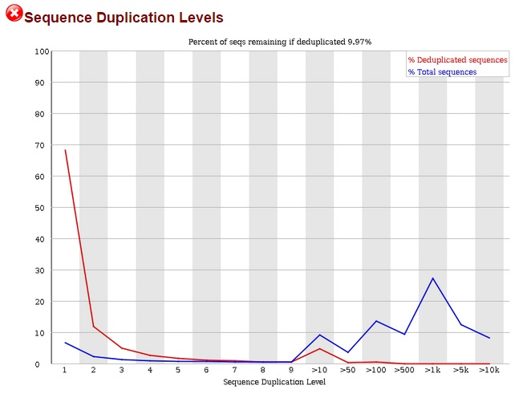

The sequence duplication levels plot shows the number of times a sequence is duplicated on the x-axis with the percent of sequences showing this duplication level on the y-axis. Normally a genome will have a sequence duplication level of 1 to 3 for the majority of sequences, with only a handful having a duplication level higher than this; the line should have an inverse log shape. A high duplication level for a large percentage of sequences is usually indicative of contamination. Once again we see that the use of 16S sequencing data yield confusing results; the above result is normal considering the input sequences. This module will issue a warning if more than 20% of the sequences are duplicated, and a failure if more than 50% of the sequences are duplicated. A warning or failure can also result from PCR artifacts.

###10: Overrepresented sequences
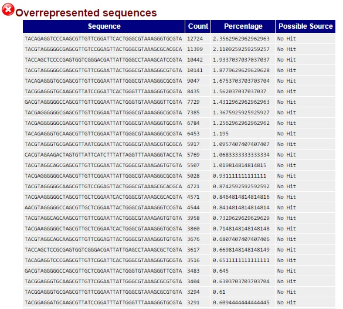

If a certain sequence is calculated to represent more than 0.1% of the entire genome, it will be flagged as an overrepresented sequence and yield a warning for this module. The presence of sequences that represent more than 1% of the whole genome will result in a failure, as seen above.
These overrepresented sequences are seen because we are looking at 16S data; if we did not see this many overrepresented sequences, there would be a serious problem. Another frequent source of "overrepresented sequences" is Illumina adapters, which is why it's a good idea to trim sequences before running FastQC.

The program searches for possible matches to identified overrepresented sequences, although this search frequently returns "no hit". However it is usually quite easy to identify the overrepresented sequences by doing a simple BLAST search.


###11: Adapter content
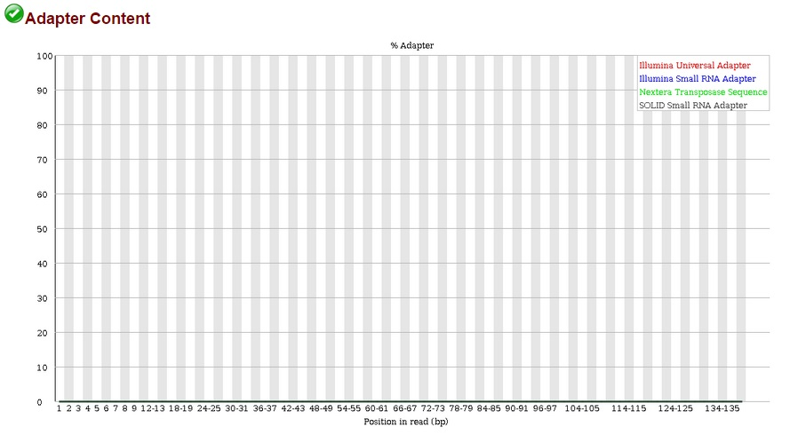
This module searches for specific adapter sequences. A sequence that makes up more than 5% of the total will cause a warning for this module, and a sequence that makes up more than 10% of the total will cause a failure. Our example shows no contamination with adapter sequences, which is ideal. If there were a significant number of adapter sequences present, we would want to use a trimming program to remove them before further analysis.


###12: Kmer content
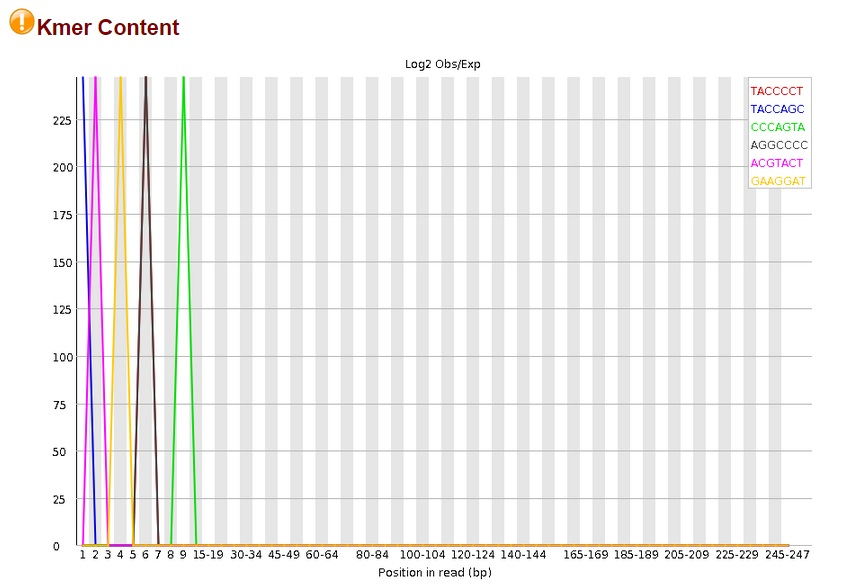
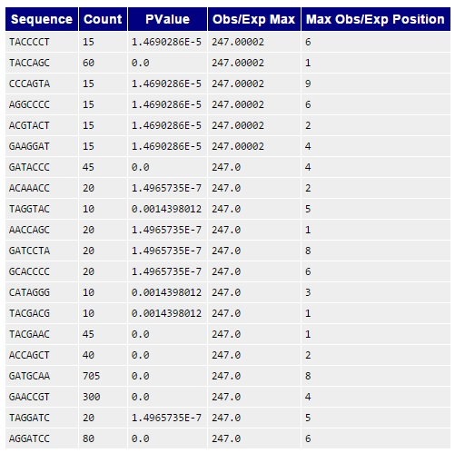


In a completely random library, any kmers would be expected to be seen about equally in each position (from 1-150 in this case). Any kmers that are specifically enriched at a particular site are reported in this module. If a kmer is enriched at a specific site with a p-value of less than 0.01, a warning will be displayed. A failure for this module occurs if a kmer is enriched at a site with a p-value of less than 10^-5.
We have failed this module, again due to the fact that we are using 16S sequences. As with the overrepresented sequences, we are expecting to see well-represented kmers because of high sequence conservation in the 16S region.
In non-enriched reads, it is relatively common to see highly represented kmers near the beginning of a sequence because of adapters.


###For FastQC questions, check the [documentation](http://www.bioinformatics.babraham.ac.uk/projects/fastqc/Help/). Happy quality checking!
