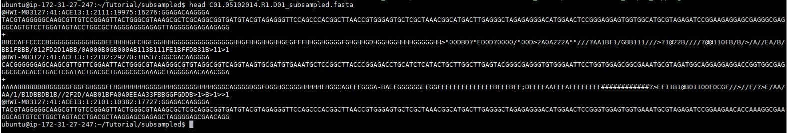
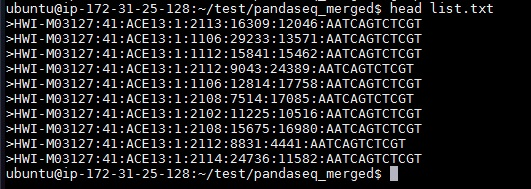
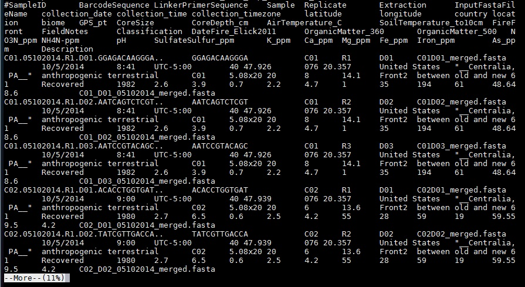
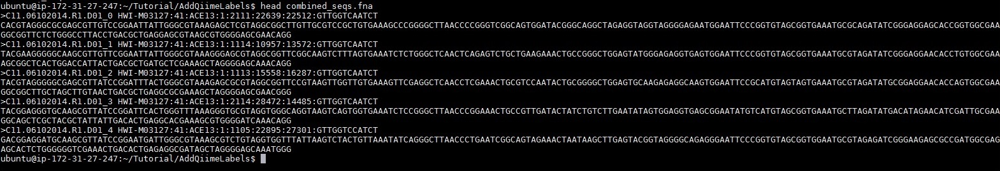
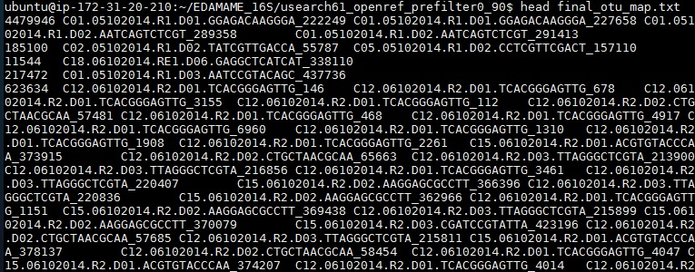

#Intro to QIIME
Authored by Ashley Shade

Modified by Sang-Hoon Lee and Siobhan Cusack

##1.1 Getting started
For this tutorial, we will be using the 16S sequencing data that we previously downloaded and unzipped. Let's connect to our EC2 instance. One we've done that, we'll navigate to the directory containing those files:
```
cd EDAMAME_16S/Fastq
```
You should see 54 files, all ending in .fastq.

####1.2 Subsampling
  We initially had 54 samples with ~200,000 reads each, which is way too big to handle for a workshop, or for troubleshooting and developing an analysis workflow. In order to efficiently process these data, we had to subsample them to 5,000 reads per sample. We already did this for you, but let's practice subsampling on this smaller dataset so that you know how to do it.

  We used [Seqtk](https://github.com/lh3/seqtk) for subsampling, so first we'll have to install Seqtk.

```  
git clone https://github.com/lh3/seqtk.git
```
Navigate to the new seqtk directory to execute the next commands.
```
sudo make
sudo cp seqtk /usr/local/bin
 ```
 Now that we've installed Seqtk, we'll run this code to randomly pick 500 reads from each of our samples.
 Navigate to the EDAMAME_16S/Fastq folder, then run seqtk:
```
seqtk sample -s 100 C01D01F_sub.fastq 500 > C01D01F_sub500.fastq
```
This command is saying "pull 500 sequences from the fastq file specified."  The -s 100 flag specifies using a random seed (100). For paired-end reads that are going to be merged, it is important to specify the exact same seed so that the reads can be matched correctly later.
We should have a new file with subsampled sequences in it called C01D01_sub500.fastq.

Sanity check:  how do we know that this new file actually has 500 sequences in it?  If we insepct the header of the fastq file, we'll see that every sequences begins with a character string "@HWI."  Thus, we can use grep to count the number of @HWI's in the file to count the number of sequences.
```
grep -c @HWI C01D01F_sub500.fastq
```

###1.3 Assembling Illumina paired-end sequences

Our sequences are 16S rRNA amplicons sequenced with MiSeq. We will use [PANDAseq](http://www.ncbi.nlm.nih.gov/pubmed/22333067) to assemble the forward and reverse reads.

First we will need to install pandaseq as it is not included in the QIIME environment.  Move back to your home directory before installing.

```
which pandaseq
```
This should not return anything since we have not yet installed it.

```
git clone http://github.com/neufeld/pandaseq.git/
cd pandaseq
./autogen.sh && ./configure && make && sudo make install
sudo ldconfig
which pandaseq
```

If pandaseq has installed properly, this will return "/usr/local/bin/pandaseq"

Now, navigate back to the EDAMAME 16S subsampled dataset directory, and use `mkdir` to create a new directory called "pandaseq_merged_reads"
```
mkdir pandaseq_merged_reads
```

####1.4 Join paired-end reads with PANDAseq
```
pandaseq -f C01D01F_sub.fastq -r C01D01R_sub.fastq -w pandaseq_merged_reads/C01D01_merged.fasta -g pandaseq_merged_reads/C01D01_merged.log -B -A simple_bayesian -l 253 -L 253 -o 47 -O 47 -t 0.9
```
Let's look carefully at the anatomy of this command.

  -  `pandaseq` calls the package of pandaseq scripts.
  -  `-f ` C01D01F_sub.fastq tells the script where to find the forward read.
  -  `-r` tells the script where to find its matching reverse read.
  -  `-w pandaseq_merged_reads/C01D01_merged.fasta` directs the script to make a new fasta file of the assembled reads and to put it in the "pandaseq_merged_reads" directory.
  -  `-g C01D01_merged.log` selects an option of creating a log file.
  -  `-B` means that the input sequences do not have a barcode.
  -  `-A` is the algorithm used for assembly.
  -  `-L` specifies the maximum length of the assembled reads, which, in truth, should be 253 bp. This is a very important option to specify, otherwise PANDAseq will assemble a lot of crazy-long sequences.
  -  `-O` specifies the amount of overlap allowed between the forward and reverse sequences.
  -  `-t` is a quality score between 0 and 1 that each sequence must meet to be kept in the final output.  In our experience, this is a very important parameter - we did some testing of the threshold and found that 0.9 was optimal.


  All of the above information, and more options, are fully described in the [PANDAseq Manual.](http://neufeldserver.uwaterloo.ca/~apmasell/pandaseq_man1.html).  The log file includes details as to how well the merging went.

### 1.5  Sanity check and file inspection.

There are some questions you may be having: What does pandaseq return?  How do I know that it returned sequences the size I expect?  Are the primers still attached?

It turns out that we had primers/barcodes removed before we started merging, but let's pretend for a minute that we had no idea about that.  How could we check?  Say we know that one of the barcode sequences is: GTCTAATTCCGA

```
cd pandaseq_merged_reads
```

```
head C01D01_merged.fastq
```

  

```
grep  GTCTAATTCCGA C01D01_merged.fasta
```

When you execute the above command, the terminal does not return anything.  This means that the primer sequence was not found in the file, suggesting that PANDAseq did, in fact, trim them.

We can double check our sanity by using a positive control.  Let's use `grep` to find a character string that we know is there, for instance the "M03127" string identifying the first sequence.

```
grep M03127 C01D01_merged.fasta
```

Whoa!  That is hard to read all of those lines. Let's put the results into a list by appending `> list.txt` to the command.  The ">" symbol means to output the results to a new file, which is specified next.  


```
grep M03127 C01D01_merged.fasta > list.txt
```

This creates a new file called "list.txt", in which all instances of the character string "M03127" are provided.  Let's look at the head.

```
head list.txt
```

  

Our positive control worked, and we should be convinced and joyous that we executed `grep` correctly AND that the primers were trimmed by PANDAseq.  We can now remove the list file.

```
rm list.txt
```

Let's also remove the merged file; we're going to make a new one using AUTOMATION in a second.
```
rm C01D01_merged.fasta
```

### 1.6  Automate paired-end merging with a shell script.

We would have to execute an iteration of the PANDAseq command for every pair of reads that need to be assembled. This could take a long time.  So, we'll use a [shell script](https://github.com/edamame-course/2015-tutorials/blob/master/QIIME_files/Cen_pandaseq_merge.sh) to automate the task. You'll also need this [list](https://github.com/edamame-course/2015-tutorials/blob/master/QIIME_files/list2.txt) of file names.

To automatically download the script and list onto the AMI, first navigate to the "Fastq" directory, and then use `curl` to get the raw files.
```
curl -O https://raw.githubusercontent.com/edamame-course/2015-tutorials/master/QIIME_files/list2.txt
```
```
curl -O https://raw.githubusercontent.com/edamame-course/2015-tutorials/master/QIIME_files/Cen_pandaseq_merge.sh
```

Change permissions on the script to make it executable:
```
chmod 755 Cen_pandaseq_merge.sh
```

Execute the script from the Fastq Directory.

```
./Cen_pandaseq_merge.sh
```

### 1.7  Sanity check #2.

How many files were we expecting from the assembly?  There were 54 pairs to be assembled, and we are generating one assembled fasta and one log for each.  Thus, the pandaseq_merged_reads directory should contain 108 files.  Navigate up one directory, and then use the `wc` (word count) command to check the number of files in the directory.

```
ls -1 pandaseq_merged_reads | wc -l
```

The terminal should return the number "108."  Let's move this whole directory up one level so that we can access more easily with QIIME:
```
mv pandaseq_merged_reads/ ..
```

Congratulations, you lucky duck! You've assembled paired-end reads!  

  

###1.8 Understanding the QIIME mapping file

QIIME requires a [mapping file](http://qiime.org/documentation/file_formats.html) for most analyses.  This file is important because it links the sample IDs with their metadata (and, with their primers/barcodes if using QIIME for quality-control).

Let's spend few moments getting to know the mapping file.  Navigate to the MappingFiles subdirectory in the EDAMAME_16S directory.

```
more Centralia_Full_Map.txt
```



A clear and comprehensive mapping file should contain all of the information that will be used in downstream analyses.  The mapping file includes both categorical (qualitative) and numeric (quantitative) contextual information about a sample. This could include, for example, information about the subject (sex, weight), the experimental treatment, time or spatial location, and all other measured variables (e.g., pH, oxygen, glucose levels). Creating a clear mapping file will provide direction as to appropriate analyses needed to test hypotheses.  Basically, all information for all anticipated analyses should be in the mapping file.

*Hint*:  Mapping files are also a great way to organize all of the data for posterity in the research group, and can provide a clear framework for making a [database](http://swcarpentry.github.io/sql-novice-survey/).  New lab members interested in repeating the analysis should have all of the required information in the mapping file.  PIs should ask their students to curate and deposit both mapping files and raw data files.

Guidelines for formatting map files:
  - Mapping files should be tab-delimited
  - The first column must be "#SampleIDs" (commented out using the `#`).
  -  SampleIDs are VERY IMPORTANT. Choose wisely! Ideally, a user who did not design the experiment should be able to distinguish the samples easily. In QIIME, SampleIDs must be alphanumeric characters or periods.  They cannot have underscores.
  - The last column must be "Description".
  - There can be as many in-between columns of contextual data as needed.
  - If you plan to use QIIME for quality control (which we do not need because the PANDAseq merger included QC), the BarcodeSequence and LinkerPrimer sequence columns are also needed, as the second and third columns, respectively.
  - Excel can cause formatting heartache.  See more details [here](misc/QIIMETutorial_Misc/MapFormatExcelHeartAche.md).

### 1.9  Merging assembled reads into the one big ol' data file.

QIIME expects all of the data to be in one file, and, currently, we have one separate fastq file for each assembled read.  We will add labels to each sample and merge into one fasta file using the `add_qiime_labels.py` script. Documentation is [here](http://qiime.org/scripts/add_qiime_labels.html).

Navigate back to the EDAMAME_16S directory, then execute the following command:

```
add_qiime_labels.py -i Fastq/pandaseq_merged_reads/ -m MappingFiles/Centralia_Full_Map.txt -c InputFastaFileName -n 1
```
Inspect the new file "combined_seqs.fna."

```
head combined_seqs.fna
```

  


Observe that QIIME has added the SampleIDs from the mapping file to the start of each sequence.  This allows QIIME to quickly link each sequence to its sampleID and metadata.

While we are inspecting the combined_seqs.fna file, let's confirm how many sequences we have in the dataset.

```
count_seqs.py -i combined_seqs.fna
```

This is a nice QIIME command to call frequently, because it provides the total number of sequences in a file, as well as some information about the lengths of those sequences.  But, suppose we wanted to know more than the median/mean of these sequences?

Another trick with QIIME is that you can call all the mothur commands within the QIIME environment, which is very handy.  mothur offers a very useful command called `summary.seqs`, which operates on a fasta/fna file to give summary statistics about its contents.  We will cover mothur in all its glory later, but for now, execute the command:

```
mothur
```

```
summary.seqs(fasta=combined_seqs.fna)
```

Note that both summary.seqs and count_seqs.py have returned the same total number of seqs in the .fna file.  Use the following command to quit the mothur environment and return to QIIME.  

```
quit()
```


### 1.10  Picking Operational Taxonomic Units, OTUs.
Picking OTUs is sometimes called "clustering," as sequences with some threshold of identity are "clustered" together to into an OTU.

  *Important decision*: Should I use a de-novo method of picking OTUs or a reference-based method, or some combination? ([Or not at all?](http://www.mendeley.com/catalog/interpreting-16s-metagenomic-data-without-clustering-achieve-subotu-resolution/)). The answer to this will depend, in part, on what is known about the community a priori.  For instance, a human or mouse gut bacterial community will have lots of representatives in well-curated 16S databases, simply because these communities are relatively well-studied.  Therefore, a reference-based method may be preferred.  The limitation is that any taxa that are unknown or previously unidentified will be omitted from the community.  As another example, a community from a lesser-known environment, like Mars or a cave, or a community from a relatively less-explored environment would have fewer representative taxa in even the best databases.  Therefore, one would miss a lot of taxa if using a reference-based method.  The third option is to use a reference database but to set aside any sequences that do not have good matches to that database, and then to cluster these de novo.

  For this tutorial, we are going to use an OTU-picking approach that uses a reference to identify as many OTUs as possible, but also includes any "new" sequences that do not hit the database.  It is called "open reference" OTU picking, and you can read more about it in this [paper](https://peerj.com/articles/545/) by Rideout et al.

We use the QIIME command: `pick_open_reference_otus.py` for this step.  Documentation is [here](http://qiime.org/scripts/pick_open_reference_otus.html).
The default QIIME 1.9.1 method for OTU picking is uclust, but we will use the [usearch](http://www.drive5.com/usearch/) algorithm because it incorporates a chimera-check.  However, we encourage you to explore different OTU clustering algorithms to understand how they perform.  They are not created equal.

###Installing usearch61
While in the home directory, get the usearch and usearch61 files:
```
cd 
curl -O https://raw.githubusercontent.com/edamame-course/2015-tutorials/master/QIIME_files/usearch5.2.236_i86linux32
curl -O https://raw.githubusercontent.com/edamame-course/2015-tutorials/master/QIIME_files/usearch6.1.544_i86linux32
```
Now we need to put them in the correct path and change the permissions:

```
sudo cp usearch5.2.236_i86linux32 /usr/local/bin/usearch
sudo chmod +x /usr/local/bin/usearch

sudo cp usearch6.1.544_i86linux32 /usr/local/bin/usearch61
sudo chmod +x /usr/local/bin/usearch61
print_qiime_config.py -tf
```
This should show that the install did not have any failures.

This next step will take about 45 minutes.

Before continuing, make sure you are in the "EDAMAME_16S" directory.

```
pick_open_reference_otus.py -i combined_seqs.fna -m usearch61 -o usearch61_openref/ -f
```

In the above script:
  - We tell QIIME to look for the input file `-i`, "combined_seqs.fna".
  - We chose the clustering method usearch61 `-m`
  - We specify that output files should go in a new folder, usearch61_openref/
  - We tell the program to overwrite already-existing files in the folder if we are running this program more than once (-f)

Navigate into the usearch61_openref/ folder and inspect the log and the resulting final_otu_map.txt file, using `head`.  You should see an OTU ID, starting at "0" the the left most column.  After that number, there is a list of Sequence IDs that have been clustered into that OTU ID.  The first part of the sequence ID is the SampleID from which it came, and the second part is the sequence number within that sample.  



In the usearch61_openref/ folder, we can also see several new directories that we're interested in right now: step1_OTUs, step2_OTUs, step3_OTUs, and step4_OTUs. As the [documentation for pick_open_reference_otus.py](http://qiime.org/scripts/pick_open_reference_otus.html) explains, step 1 picks OTUs based on a [reference database](http://greengenes.lbl.gov/cgi-bin/nph-index.cgi), producing a file of successfully clustered OTUs and a file of sequences that failed to cluster based on the reference database. Step 2 performs computationally expensive de novo clustering for a subset of the failed sequences from step 1, and picks a representative sequence from each new cluster to add to the original database. Step 3 picks OTUs from all of the failed sequences, not just the subset used in step 2, based on the new database generated in step 2. Step 4 performs de novo clustering on all remaining OTUs.
Inspect the combined_seqs_otus.txt file from the step1_otus directory.


### 1.11 Align representative sequences.

Navigate back to the usearch61 directory. We will align our representative sequences using PyNAST, which uses a "gold" reference template for the alignment.  QIIME uses a "gold" pre-aligned template made from the greengenes database.  The default alignment to the template is minimum 75% sequence identity and minimum length 150. The default minimum length is not great for short reads like we have, so we will be more generous and change the default. What should we change it to?

```
count_seqs.py -i
```

Given that our average assembled read length is ~252 bp, let's decide that at least 100 bp must align.  We will have the `-e` option to 100. The alignment will take a few minutes.  Documentation for `align_seqs.py` is [here](http://qiime.org/scripts/align_seqs.html).

```
align_seqs.py -i usearch61_openref_prefilter0_90/rep_set.fna -o pynast_aligned/ -e 100
```

Navigate into the pynast_aligned directory.  There are three files waiting there:  one file of sequences that failed to align, one of sequences that did align, and a log file.  Inspect each.

```
count_seqs.py -i rep_set_failures.fasta
```

```
count_seqs.py -i rep_set_aligned.fasta
```

We see that there were 32 rep. sequences that failed to align, and approximately 24831 that did.  (Also, notice what short-read alignments generally look like...not amazing).

*Sanity check?*  If you like, [BLAST](http://blast.ncbi.nlm.nih.gov/Blast.cgi?PAGE_TYPE=BlastSearch&BLAST_SPEC=MicrobialGenomes) the top sequence that failed to align to convince yourself that it is, indeed, a pitiful failure.

If, in the future, you ever have a large proportion of rep seqs that fail to align, it could be due to:
  *  Hooray! These are novel organisms! (But, think about the habitat before jumping to conclusions. As lucky as we would be to discover new species in the mouse gut, this is unlikely.)
  *  The alignment parameters were too stringent for short reads, causing "real" sequences to fail alignment.
  * The paired-end merger algorithm (e.g., pandaseq) did not do a perfect job, and concatenated ends that do not belong together.
  * Some combination of the above, as well as some other scenarios.

We will filter out these failed-to-align sequences (really, the removing the entire OTU cluster that they represent) from the dataset after we make the OTU table.  In the meantime, let's create a text file of all the names of the rep. sequence OTU IDs that we want to remove.  We only have three failures, so we easily could do it by hand.  What if we had more?  Here's how to automate the generation of the "cdhit_rep_seqs_failures_names.txt" file using the `grep` command. We will not go into details, but general grep help is [here](http://unixhelp.ed.ac.uk/CGI/man-cgi?grep). Navigate back into the QIIMETutorial directory to run the grep command.

```
grep -o -E "^>\w+" pynast_aligned/rep_set_failures.fasta | tr -d ">" > pynast_aligned/rep_set_failures_names.txt
```

Congratulations!  You just had the QIIME of Your Life!

  

#Resources and help
## QIIME
  - [QIIME](qiime.org) offers a suite of developer-designed [tutorials](http://www.qiime.org/tutorials/tutorial.html).
  - [Documentation](http://www.qiime.org/scripts/index.html) for all QIIME scripts.
  - There is a very active [QIIME Forum](https://groups.google.com/forum/#!forum/qiime-forum) on Google Groups.  This is a great place to troubleshoot problems, responses often are returned in a few hours!
  - The [QIIME Blog](http://qiime.wordpress.com/) provides updates like bug fixes, new features, and new releases.
  - QIIME development is on [GitHub](https://github.com/biocore/qiime).
  - Remember that QIIME is a workflow environment, and the original algorithms/software that are compiled into QIIME must be referenced individually (e.g., PyNAST, RDP classifier, etc...)

  ##SeqTk
  - [GitHub](https://github.com/lh3/seqtk)
  - [ANGUS Documentation](http://ged.msu.edu/angus/tutorials-2013/seqtk_tools.html)

  ##PANDAseq
  - [GitHub](https://github.com/neufeld/pandaseq/wiki/PANDAseq-Assembler)
  - [AXIOME](http://www.biomedcentral.com/content/pdf/2047-217X-2-3.pdf)
  - [PANDASeq Paper](http://www.biomedcentral.com/1471-2105/13/31)

-----------------------------------------------
-----------------------------------------------
